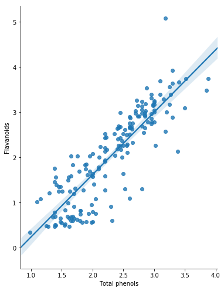
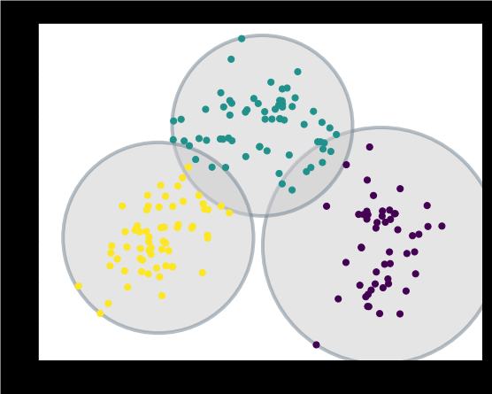
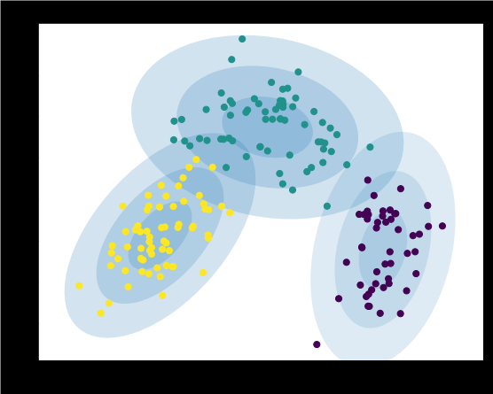
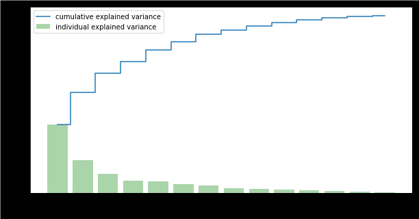

# Wine Types Clustering using K-Means, EM-GMM and PCA 

In this project, we cluster different types of wines using use [Wine Dataset](http://archive.ics.uci.edu/ml/datasets/Wine) and cluster algorithms such [K-Means](https://en.wikipedia.org/wiki/K-means_clustering), [Expectation Maximization](https://en.wikipedia.org/wiki/Expectation%E2%80%93maximization_algorithm) - [Gaussian Mixture Model](https://en.wikipedia.org/wiki/Mixture_model) (EM-GMM), and [Principle Component Analysis](https://en.wikipedia.org/wiki/Principal_component_analysis) (PCA).

There are 13 features (1. Alcohol 2. Malicacid 3. Ash 4. Alcalinity of ash 5. Magnesium 6. Total phenols 7. Flavanoids 8. Nonflavanoid phenol) for us to feed into the cluster algorithms. We can take use of them directly or commit dimension reduction at first. Thus we 

* K-Means & EM-GMM:
	* apply K-Means and EM-GMM using 13 features directly and compare the performance;
* PCA & K-Means & EM-GMM:
	* apply PCA to select top 6 PCs;
	* apply K-Means and EM-GMM using the selected 6 Pcs and compare the performance;

We also visualize the cluster result using only top 2 PCs.

## Dataset

The [Wine Dataset](http://archive.ics.uci.edu/ml/datasets/Wine) contains the results of a chemical analysis of wines grown in a specific area of Italy. There are 178 instances of wine and 13 attributes and for
each attribute, the distribution differ a lot. The following is the scatter plot of the dataset.

The following is the heatmap of correlation of each attributes of dataset.

We can find that the following correlations are large:

• "Flavanoids" and "Total phenols" (0.86);
• "OD280" and "Flavanoids" (0.79);
• "OD280" and "Total phenols" (0.7);

The regression plot of "Flavanoids" on "Total phenols" is as follow:

We can see that the "Flavanoids" and "Total phenols" are actually highly correlated!

## Experiment

We are using [elbow method](https://en.wikipedia.org/wiki/Elbow_method_(clustering)) to choose the number of cluster. Moreover, we use [average silhouette score](https://en.wikipedia.org/wiki/Silhouette_(clustering)) and [Rand Index](https://en.wikipedia.org/wiki/Rand_index) to evaluate the performance of cluster algorithms.

### K-Means

The KMeans algorithm clusters data by trying to separate samples in n groups of equal variance, minimizing a
criterion known as the inertia or within-cluster sum-of-squares (WSS).

The following is the plot of 3 clusters of wine types using K-Means on top two PCs of dataset.

 

### EM-GMM

A Gaussian mixture model (GMM) is a probabilistic model that assumes all the data points are generated
from a mixture of a finite number of Gaussian distributions with unknown parameters. One can
think of mixture models as generalizing k-means clustering to incorporate information about the
covariance structure of the data as well as the centers of the latent Gaussians. EM-GMM algo implements the expectation-maximization (EM) algorithm for fitting mixture-of-Gaussian
models.

The following is the plot of 3 clusters of wine types using EM-GMM on top two PCs of dataset.

 

### PCA

We can take use of PCA to reduce the dimension of dataset. First of all, we are going to generate the 13 Principal Component (PA) of winenorm and check the amount and percentage of of variance explained by each of the selected components. Then we will compute the singular values corresponding to each of the selected components.

The following is the plot of cumulative explained ratio of variance using PCA on dataset.

### PCA and Cluster

In this part, we are going to select top six principal components and transform the dataset
winenorm. Then we are going to run K-Means andGMMmodel on this dimension reduced dataset.

## Evaluation

The Silhouette Score is calculated using the mean intra-cluster distance (a) and the mean nearestcluster
distance (b) for each sample. The Silhouette Coefficient for a sample is (b - a) / max(a,
b). It measures the quality of a clustering. Average silhouette method computes the average silhouette of observations for different values of k. The optimal number of clusters k is the one that maximize the average silhouette over a range of possible values for k (Kaufman and Rousseeuw 1990). We use Silihouette score to evaluate the K-Means (KM), Gaussian Mixture Model (GMM), KM+PCA, GMM+PCA methods. 

And we also use RAND Index to evaluate the performance of cluster algorithms. We compare the predicted label with true label provided. Thus the higher the Rand Index, the more precise the cluster is.

## Result

### Average Silhouette score

* Silhouette score of cluster by KM: 0.301135931311762
* Silhouette score of cluster by KM+PCA: 0.301135931311762
* Silhouette score of cluster by GMM: 0.301135931311762
* Silhouette score of cluster by GMM+PCA: 0.29783451509126274

### Adjusted Rand Index

* Adjusted Rand Index of cluster by KM: 0.9148795960669529
* Adjusted Rand Index of cluster by KM+PCA: 0.9148795960669529
* Adjusted Rand Index of cluster by GMM: 0.9148795960669529
* Adjusted Rand Index of cluster by GMM+PCA: **0.9667411092064137**

### Conclusion

We can conclude that the best model is GMM+PCA with the highest
adjusted rand index value.

**Note**: Details can be found in report `Report.pdf`.